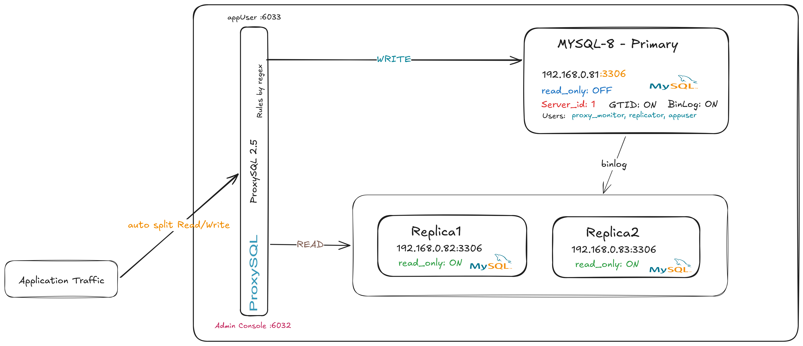

# MySQL HA Stack Ansible Automation

A production-grade Ansible project that deploys a **MySQL Primary/Replica** cluster
with **ProxySQL** (intelligent query router) for
automatic read/write splitting.

---

## Architecture



---

## File Structure

```
mysql-ha-ansible/
├── ansible.cfg                    # Ansible configuration
├── site.yml                       # Master playbook (full stack)
├── requirements.yml               # Galaxy collections
├── inventory/
│   └── hosts.ini                  # Node inventory
├── group_vars/
│   └── all.yml                    # Shared variables & passwords
├── playbooks/                     # Targeted individual playbooks
│   ├── deploy_primary.yml
│   ├── deploy_replicas.yml
│   ├── deploy_proxysql.yml
│   └── verify_replication.yml
└── roles/
    ├── common/
    ├── mysql-primary/
    │   ├── tasks/main.yml
    │   ├── templates/primary_my.cnf.j2
    │   └── handlers/main.yml
    ├── mysql-replica/
    │   ├── tasks/main.yml
    │   ├── templates/replica_my.cnf.j2
    │   └── handlers/main.yml
    └── proxysql/
        ├── tasks/main.yml
        └── templates/proxysql.cnf.j2
```

---

## Topics Covered

- [Component Summary (MySQL nodes, ProxySQL)](#component-summary)
- [Prerequisites (control node + target nodes)](#prerequisites)
- [Quick start (inventory, variables, connectivity test, full deployment)](#quick-start)
- [Targeted deployments (primary only, replicas only, ProxySQL only)](#targeted-deployments)
- [Connection endpoints (via ProxySQL, direct MySQL)](#connection-endpoints)
- [ProxySQL query routing rules (regex patterns, hostgroups)](#proxysql-query-routing-rules)
- [Verifying the stack (replication lag, ProxySQL stats)](#verifying-the-stack)
- [Troubleshooting common issues (replication, connectivity, ProxySQL routing)](#troubleshooting-common-issues)
- [Performance notes (open files limit, swappiness)](#performance-notes)
- [Security notes (Ansible Vault, read-only replicas, ProxySQL admin access)](#security-notes)
- [Incidents and failover scenarios (simulate primary failure, promote replica)](#incidents-and-failover-scenarios)
  - [First scenario simulate primary failure and promote replica](#first-scenario-simulate-primary-failure-and-promote-replica)
  - [Second scenario simulate primary failure and promote replica with backup/restore](#second-scenario-simulate-primary-failure-and-promote-replica-with-backuprestore)
- [Recommended next steps (SSL, monitoring, backup, failover automation)](#recommended-next-steps)

---

### Component Summary

| Component      | Host IP      | Port(s)   | Role                    |
| -------------- | ------------ | --------- | ----------------------- |
| MySQL Primary  | 192.168.0.81 | 3306      | Writes, binlog source   |
| MySQL Replica1 | 192.168.0.82 | 3306      | Reads, `read_only=ON`   |
| MySQL Replica2 | 192.168.0.83 | 3306      | Reads, `read_only=ON`   |
| ProxySQL       | 192.168.0.84 | 6033/6032 | Query routing + pooling |

---

## Prerequisites

### Control Node

```bash
# Install Ansible
pip3 install ansible

# Install required collections
ansible-galaxy collection install -r requirements.yml

# Install Python MySQL library
pip3 install PyMySQL
```

### Target Nodes

- Ubuntu 24.04 LTS
- SSH access with sudo privileges
- Python 3 installed

---

## Quick Start

### 1. Configure Inventory

Copy example-inventory.ini to inventory/hosts.ini with your actual IP addresses:

```ini
[mysql_primary]
mysql-primary ansible_host=YOUR_PRIMARY_IP ansible_user=ubuntu ansible_become=true

[mysql_replicas]
mysql-replica1 ansible_host=YOUR_REPLICA1_IP ansible_user=ubuntu ansible_become=true
mysql-replica2 ansible_host=YOUR_REPLICA2_IP ansible_user=ubuntu ansible_become=true

[haproxy]
haproxy-node ansible_host=YOUR_HAPROXY_IP ansible_user=ubuntu ansible_become=true

[proxysql]
proxysql-node ansible_host=YOUR_PROXYSQL_IP ansible_user=ubuntu ansible_become=true
```

### 2. Customize Variables

Edit `group_vars/all.yml` — **change all passwords**:

```yaml
mysql_root_password: "YourSecureRootPass!"
mysql_replication_password: "YourReplPass!"
mysql_app_password: "YourAppPass!"
haproxy_stats_password: "YourStatsPass!"
proxysql_admin_password: "YourProxyAdminPass!"
proxysql_monitor_password: "YourMonitorPass!"
```

### 3. Test Connectivity

```bash
ansible all -m ping
```

### 4. Deploy Everything

```bash
# Deploy DNS resolution and SSH trust across cluster (optional but recommended)
ansible-playbook playbooks/cluster-ssh-and-dns.yml

# Full stack deployment
ansible-playbook site.yml

# Dry run (check mode)
ansible-playbook site.yml --check --diff
```

---

## Targeted Deployments

```bash
# Deploy only MySQL Primary
ansible-playbook playbooks/deploy_primary.yml

# Deploy only MySQL Replicas
ansible-playbook playbooks/deploy_replicas.yml

# Deploy only ProxySQL
ansible-playbook playbooks/deploy_proxysql.yml

# Verify replication health
ansible-playbook playbooks/verify_replication.yml
```

---

## Connection Endpoints

### Via ProxySQL (recommended automatic read/write split)

```bash
# Single endpoint ProxySQL routes automatically
mysql -h 192.168.0.84 -P 6033 -u appuser -p appdb

# ProxySQL admin console
mysql -h 192.168.0.84 -P 6032 -u proxysql_admin -p

# Useful admin queries:
SELECT * FROM mysql_servers\G
SELECT * FROM mysql_query_rules\G
SELECT * FROM stats_mysql_query_rules\G   -- query routing stats
SELECT * FROM stats_mysql_connection_pool\G
```

---

## ProxySQL Query Routing Rules

| Rule ID | Pattern                                           | Hostgroup | Target   |
| ------- | ------------------------------------------------- | --------- | -------- |
| 10      | `^(INSERT\|UPDATE\|DELETE\|REPLACE\|CREATE\|...)` | HG 10     | Primary  |
| 20      | `^SELECT`                                         | HG 20     | Replicas |

Transactions are **sticky to the writer** (`transaction_persistent=1`),
so `BEGIN ... COMMIT` blocks always go to the primary.

---

## Verifying the Stack

### Check replication lag

```bash
ansible-playbook playbooks/verify_replication.yml
```

### Manual checks

```bash
# On primary — show connected replicas
mysql -u root -p -e "SHOW REPLICA HOSTS\G"

# On any replica — check IO/SQL threads
mysql -u root -p -e "SHOW REPLICA STATUS\G" | grep -E "Running|Behind|Error"

# On ProxySQL check connection pool
mysql -h 127.0.0.1 -P 6032 -u proxysql_admin -p \
  -e "SELECT hostgroup,srv_host,status,ConnUsed,ConnFree,Latency_us FROM stats_mysql_connection_pool\G"
```

---

## Performance Notes

- Open limit soft and hard files to `65536` for MySQL processes to handle high concurrency.
- Switch of Kernel Swappiness to `0` to prioritize MySQL performance over system caching.

---

## Security Notes

- All passwords in `group_vars/all.yml` should be stored in **Ansible Vault** for production:
  ```bash
  ansible-vault encrypt group_vars/all.yml
  ansible-playbook site.yml --ask-vault-pass
  ```
- Replicas have `read_only=ON` and `super_read_only=ON` enforced at the MySQL level.
- ProxySQL admin port (6032) is firewalled to localhost only.(so using tool like mysqlworkbench will not work to connect to ProxySQL admin interface, you need to ssh into the ProxySQL node and then connect to the admin interface using mysql client)

---

## Troubleshooting Common Issues

### Common Issues

| Symptom                          | Check                                                         |
| -------------------------------- | ------------------------------------------------------------- |
| Replica IO thread stopped        | Firewall port 3306 between primary and replicas               |
| ProxySQL routing all to primary  | Query rules regex `LOAD MYSQL QUERY RULES TO RUNTIME`         |
| `Access denied` through ProxySQL | User added to `mysql_users` and `LOAD MYSQL USERS TO RUNTIME` |
| High replication lag             | `Seconds_Behind_Master` in `SHOW REPLICA STATUS`              |
| Access denied                    | Ensure user exists in mysql_users and load to runtime         |

### Replication Issues

```shell
mysql -e "SHOW REPLICA STATUS\G" | grep -E "Running|Behind|Error"
```

### Network & Connectivity

Test MySQL port connectivity from ProxySQL to MySQL nodes:

```shell
nc -zv 192.168.0.82 3306
nc -zv 192.168.0.83 3306
```

Verify MySQL bind address:

```sql
SHOW VARIABLES LIKE 'bind_address';
```

### ProxySQL Monitoring & Logs

Connect to admin interface and check for connection errors:

```shell
mysql -u proxysql_admin -p -h 127.0.0.1 -P 6032
```

Check recent connection errors:

```sql
SELECT * FROM monitor.mysql_server_connect_log
ORDER BY time_start_us DESC
LIMIT 20;
```

Check ping failures (network/server issues):

```sql
SELECT * FROM monitor.mysql_server_ping_log
ORDER BY time_start_us DESC
```

Check read-only violations (writes sent to replicas):

```sql
SELECT * FROM monitor.mysql_server_read_only_log
ORDER BY time_start_us DESC
LIMIT 20;
```

### MySQL Configuration Validation

```shell
sudo mysqld --validate-config
```

### Connection Reference using tool like MySL Workbench or DBeaver or PHPMyAdmin etc

Application (via ProxySQL):

```
Host: ProxySQL IP
Port: 6033
User: app_user
```

ProxySQL Admin(Only when you add `proxysql_admin` user to `mysql_users` and load to runtime):

```
Host: ProxySQL IP
Port: 6032
User: proxysql_admin
```

Direct MySQL Debugging:

```
Host: MySQL Primary/Replica
Port: 3306
User: root
```

---

## Incidents and Failover Scenarios

1. Simulate primary failure and promote replica (covered in the first failover scenario above)
2. Simulate primary failure and promote replica with backup/restore (covered in the second failover scenario below)
3. Simulate replica failure and rebuild replica from primary
4. Simulate ProxySQL failure and recover ProxySQL with minimal downtime

[back to top](#mysql-ha-stack-ansible-automation)

---

## First Scenario Simulate Primary Failure and Promote Replica

1. Create a table `todos` with some test data on primary to verify replication and failover later:

```bash
ansible-playbook playbooks/create-todos-table.yml
```

- It creates a table called `todos` in `appdb` database.
- It also inserts some test data into the `todos` table to verify replication and failover later.

2. Stop MySQL on primary to simulate failure:

```bash
sudo systemctl stop mysql
```

3. Run failover playbook to promote replica and reconfigure ProxySQL:

```bash
ansible-playbook playbooks/failover/promote-replica.yml -e new_primary=replica1
```

- Update inventory/hosts.ini to move primary from old primary to new primary group:

```ini
[mysql_primary]
replica1 ansible_host=192.168.0.82 ansible_user=vboxuser ansible_become=true # new promoted primary

[mysql_replicas]
primary ansible_host=192.168.0.81 ansible_user=vboxuser ansible_become=true # Old primary
replica2 ansible_host=192.168.0.83 ansible_user=vboxuser ansible_become=true
```

- Update ProxySQL configuration to point to new primary and remove old primary from hostgroup 10 (primary group) and add it to hostgroup 20 (replica group) by executing the following playbook:

```bash
ansible-playbook playbooks/failover/update-proxysql-hostgroups.yml \
-e new_primary=replica1
```

- Re-pointing to new primary and reconfiguring replicas to replicate from new primary by executing the following playbooks:

```bash
ansible-playbook playbooks/failover/repoint-replicas.yml \
-e "new_primary_host=192.168.0.82"
```

- Show replication node list on New primary to confirm it is now the primary and old primary is now a replica:

```bash
# SSH into new primary
ssh vboxuser@192.168.0.82

# Connect to ProxySQL admin interface
mysql -u proxysql_admin -p -P 6032 -h 192.168.0.84

SELECT hostgroup_id, hostname, port, status, weight
FROM mysql_servers;
```

4. Write data to new primary using ProxySQL endpoint and verify it replicates to the remaining replica:

- Connect to ProxySQL and run a write query:

```bash
mysql -u proxysql_admin -p -P 6032 -h 192.168.0.84
```

- Run a test insert query to confirm the new primary is accepting writes:

```sql
USE appdb;
INSERT INTO todos (title, description) VALUES ('Failover Test', 'Testing failover scenario');
```

- Check replication status on the remaining replica to confirm it is receiving updates from the new primary:
  - Connect to replica2 directly:

  ```bash
  mysql -u root -p -h 192.168.0.83 #(replica2)
  ```

  - Then run the following query to check replication status:

  ```sql
  SHOW REPLICA STATUS\G
  ```

  check and observe the `Seconds_Behind_Master` and `Last_Error` fields to confirm replication is healthy and up to date.

5. Verify new primary and replication health:

```bash
ansible-playbook playbooks/verify_replication.yml
```

6. Put back old primary to be reachable by executing

```bash
sudo systemctl start mysql
```

7. Update `server-id` on old primary to avoid conflicts and reconfigure it as a replica of the new primary:

- Edit inventory/hosts.ini to move broken replica(old primary) to broken_replica group:

```ini
[broken_replica]
primary ansible_host=192.168.0.81 ansible_user=vboxuser ansible_become=true # old primary
```

- Then run the following playbook to update `server-id`, reconfigure replication, and add it back to ProxySQL:

```bash
ansible-playbook playbooks/failover/rebuild-broken-replicas.yml \
-e "new_primary=192.168.0.82"
```

What this playbook does:

- Updates `server-id` in MySQL config to a unique value (e.g. `server-id=3`) to avoid conflicts with the new primary
- Configures the old primary as a replica of the new primary
- Deletes old replication data and starts replication from scratch to ensure it is fully synced and healthy before being added back to ProxySQL
- Re-adds the old primary to ProxySQL as a replica once it is fully synced and healthy
- Provides final confirmation of the old primary being rebuilt and replicating from the new primary

### Troubleshooting Failover Issues

- Check on the old primary if MySQL is stopped and not accepting connections:

```bash
mysql -u root -p -h 192.168.0.81
```

- Run Query to check replication status on failed replica (old primary):
- Connect to old primary directly:

```bash
mysql -u root -p -h 192.168.0.81 #(old primary)
```

- Then run the following query to check replication status:

```sql
SELECT * FROM performance_schema.replication_applier_status_by_worker\G;
```

[back to top](#mysql-ha-stack-ansible-automation)

---

## Second Scenario Simulate Primary Failure and Promote Replica with Backup/Restore

1. Backup primary database before stopping MySQL to ensure we have a recent backup in case of any issues during failover:

```bash
ansible-playbook playbooks/backup-primary-database.yml
```

2. Stop MySQL on primary to simulate failure:

```bash
sudo systemctl stop mysql
```

3. Check replication status on replicas to confirm they are healthy and up to date before promoting:

```bash
ansible-playbook playbooks/verify-replication.yml
```

4. Promote replica(replica2) and reconfigure ProxySQL:

```bash
ansible-playbook playbooks/failover/promote-replica.yml -e new_primary=replica2
```

5. Update inventory/hosts.ini to move primary from old primary to new primary group:

```ini
[mysql_primary]
replica2 ansible_host=192.168.0.82

[broken_replica]
primary ansible_host=192.168.0.81 ansible_user=vboxuser ansible_become=true # old primary
```

6. Restore backup of old primary to new primary to ensure it is fully synced and healthy before being added back to ProxySQL:

```bash
ansible-playbook playbooks/failover/restore-primary-database.yml
```

7. Update ProxySQL configuration to point to new primary and remove old primary from hostgroup 10 (primary group) and add it to hostgroup 20 (replica group) by executing the following playbook:

```bash
ansible-playbook playbooks/failover/update-proxysql-hostgroups.yml \
-e new_primary=192.168.0.82
```

8. Reset all replicas data

```bash
ansible-playbook playbooks/failover/reset-replicas.yml
```

9. Re-build all replicas get fresh data from new primary and add them back to ProxySQL:

```bash
ansible-playbook playbooks/failover/rebuild-broken-replicas.yml \
-e "new_primary=192.168.0.82"
```

10. Import backup database to new primary and restore it to ensure it is fully synced and healthy before being added back to ProxySQL:

- Before that delete all binlog files on new primary to avoid any conflicts with the restored data:

```bash
# SSH into new primary
ssh vboxuser@192.168.0.82

# Delete all binlog files
sudo rm -rf /var/lib/mysql/mysql-bin.*
```

- Then run the following playbook to restore the backup database to new primary:

```bash
ansible-playbook playbooks/failover/restore-primary-database.yml
```

11. Re-seed replica from primary

```bash
ansible-playbook playbooks/failover/re-seed-replicas.yml \
-e "new_primary_host=192.168.0.82"
```

12. Write data to new primary using ProxySQL endpoint and verify it replicates to the remaining replica:

- Connect to ProxySQL and run a write query:

```bash
mysql -u proxysql_admin -p -P 6032 -h 192.168.0.84
```

- Run a test insert query to confirm the new primary is accepting writes:

```sql
USE appdb;
INSERT INTO todos (title, description) VALUES ('Failover Test', 'Testing second failover scenario');
```

[back to top](#mysql-ha-stack-ansible-automation)

---

## Recommended Next Steps

- [ ] Add SSL certification mTLS between ProxySQL and MySQL nodes
- [ ] Add monitoring with Prometheus + Grafana
- [x] Add backup playbook with `mysqldump` or `xtrabackup` and upload to remote storage(AWS S3)
- [ ] Add Ansible Vault for secure password management
- [x] Manual Failover using playbook to promote replica and reconfigure ProxySQL
- [ ] Failover automation playbook to promote replica and reconfigure ProxySQL
- [ ] Integrated with CI/CD pipelines for automated deployments and updates
- [ ] Make ProxySQL high available with keepalived or similar tool
- [ ] Encrypt MySQL Data at rest with LUKS or filesystem encryption
- [ ] Use better way for server-id management on replicas (e.g. dynamic generation based on inventory hostname) to avoid conflicts during failover and recovery []

[back to top](#mysql-ha-stack-ansible-automation)

---
